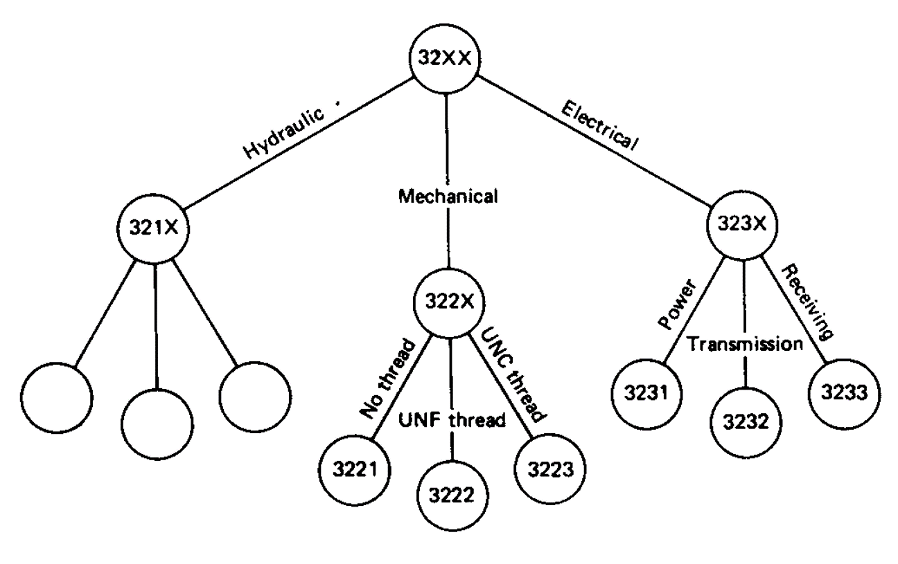
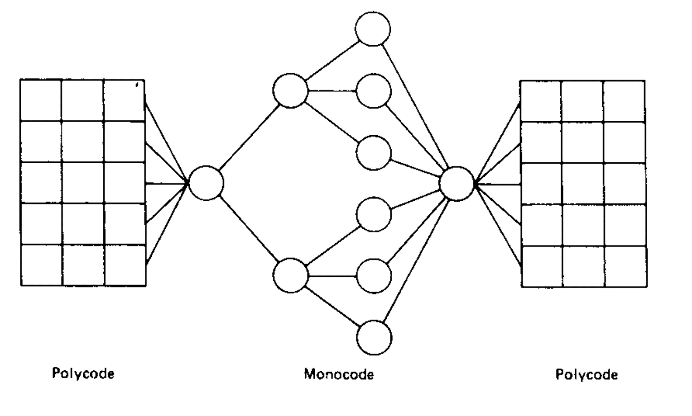
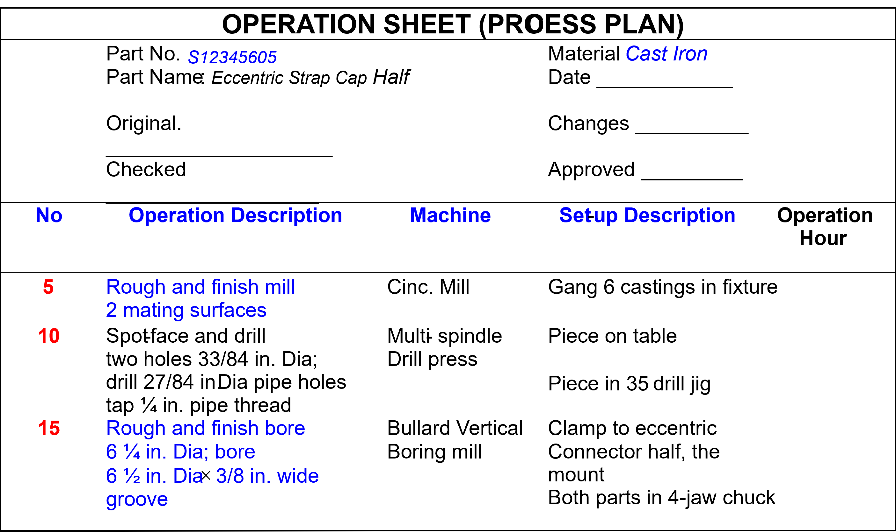
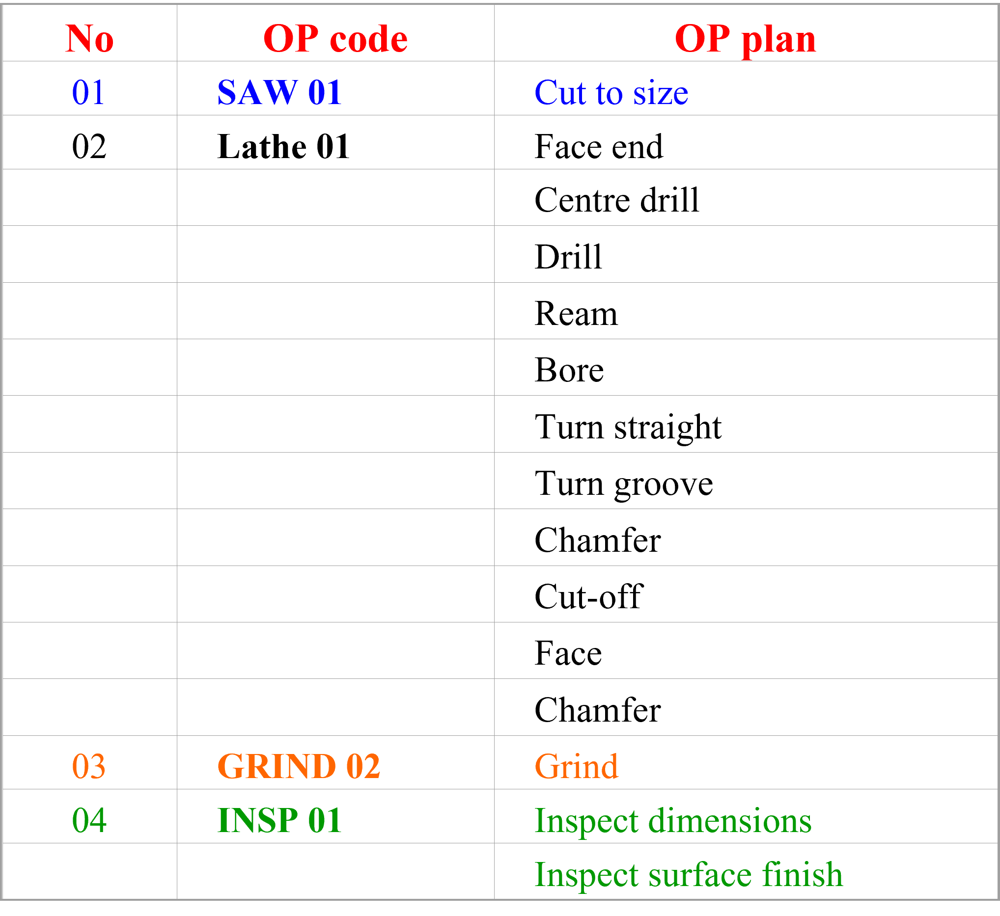
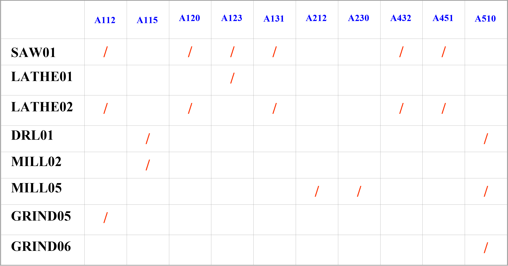

# Group Technology

[TOC]

## Introduction

- **History**: One important way of applying reason is to *relate similar things*
- **Useful for**: Information storing and retrieval
- **Defined time**: formally defined as GT in 1958

> similar: having a resemblance in appearance, character, or quantity **without being identical**

### Definition of GT

#### General definition

GT is the realization that a **simple solution** can be found to a set of similar problems by grouping similar problems, thus saving time and effort.

#### Specific definition

GT is defined as a manufacturing (parts/components design and fabrication) philosophy in which **similar parts** are identified and grouped together (into a ***Part Family***)

To take advantage of their **similarities** in **design**(geometry) and **manufacturing**(fabrication steps)

### General Applications of GT

#### In Part Design

A **new design** can be created by simply **modifying an existing part design** from the same **part family**

#### In Part Manufacturing

- Parts requiring **similar processes** can be grouped into a **part family**
- A **process plan for a new part** in this family can be created by simple **modifying the standard process plan** for this family of parts
- Parts in the same **family** can be machined in the same machine cell

## Part families

### An example of part family

For a family of spur gears

- similar shape(geometry)
- need the similar manufacturing processes

### Definition

A part family is a collection of similar parts because of geometric shape or similar processing steps

When applying GT, part families need to be established first

> The parts within the same part family are different

- Types of part families
  - Design
  - Manufacturing

### Methods to Group Parts into Families

- Visual inspection
  - Least sophisticated and least expensive
  - Least accurate
- **Classification and coding**
  - Classifying by individual design and/or manufacturing attributes
  - Most commonly used today
    - Parts are firstly coded in given coding scheme
    - Then parts are classified into groups
    - In each group the parts have the same or similar codes
- **Production flow analysis**
  - Using **route sheet (process plan)** instead of part drawings (design attributes)
  - Parts with identical or similar routings are classified into the same family
  
## Coding and classification (C&C)

### Relationship between coding and classification

- Coding: a process of **establishing symbols** used for meaningful communications
- Classification: a separation process in which items are separated into groups
- Coding can be used for classification purposes, and classification requirements must be considered during the construction of a coding scheme

### Three types of C&C system

- Based on part **design attributes** only
- Based on part **manufacturing attributes** only
- Based on **both** design and manufacturing **attributes**

### Coding Scheme Development: Factors

1. the population of components (rotational, prismatic, deep-drawn, sheet metal)
2. the details of the code should represent (attributes)
3. the code structure: hierarchical, chian, or hybrid
4. the value range for each digit in a code

Each part can be represented by **a code** and **one code only**

Classification can then be carried out based on the **similarity of the codes** to group parts into families

#### Design and manufacturing attributes (for rotational parts)

|     Design Attributes     | Manufacturing Attributes |
| :-----------------------: | :----------------------: |
|   Basic internal shape    |      Major process       |
|   Basic external shape    |      Minor process       |
| **Length/diameter ratio** |   **Major Dimensions**   |
|                           |  Length/diameter ratio   |
|       Material type       |    **Surface finish**    |
|       Part function       |       Machine tool       |
|   **Major dimensions**    |    Operation sequence    |
|                           |     Production time      |
|     Minor dimensions      |        Batch size        |
|        Tolerances         |    Annual production     |
|    **Surface finish**     |         Fixtures         |
|                           |      Cutting tools       |

#### Code structures

##### Chain structure (poly-code)

Every digit in a code position represents a distinct bit of information, regardless of the processing digit

- Advantage: easy to construct and use
- Drawback: cannot be as detailed as hierarchical structures with the same number of coding-digits
- miao miao miao jiujiujiu =.=

| Digit position |       d1       |       d2       |      d3       |
| :------------: | :------------: | :------------: | :-----------: |
|     Values     | External shape | Internal shape |     Holes     |
|       1        |   E-shape 1    |   In-shape 1   |     Axial     |
|       2        |   E-shape 2    |   In-shape 2   |     Cross     |
|       3        |   E-shape 3    |   In-shape 3   | Axial & Cross |

##### Hierarchical structure (mono-code)

The interpretation of each succeeding symbol depends on the value of the proceeding symbol

- Advantage: represent a large amount of information with very few code positions
- Drawback: difficult to develop because of all the branches in the hierarchy that must be defined

##### Hybrid structure

### Applications of C&C systems

Code potential designs before they are completely designed

A designer sketches a concept and then codes the sketch. Identical and **similarly coded parts can then be retrieved** from the parts archives

- If an existing part can be used, the process ends
- If no existing part can be used, perhaps a variant can be used
  - The existing part drawing simply can be modified
  - Existing process plans may also need only minor modifications

### Limitations of C&C Schemes

C&C is mainly based on geometric information, which is **effective for design applications** but may find problems in manufacturing applications

- parts with similar geometries may require different process routings
- parts with different geometries may require same process routings

## Production flow analysis

PFA is used for identifying part families by grouping parts with identical or similar routings

- Define the **population of the parts** to be analysed and **collect the process routings** for each part from the route sheet
- The **process routing** of each part is represented in a code form called ==operation-plan code==
- **Identifying part families** whose routings share the same or similar OP codes

> In real situation, numerical programming methods (**FPA algorithms**) must be used to form part families

### OP Code

An OP code represents a series of operations on one machine an/or one workstation

Operations represented by an OP code are called an operation plan

OP code is used to present a logical group of operations on a machine so that a process plan can be represented in a much more concise manner

### PFA Matrix

- Each row represents an OP code
- Each column represents a part

For $M_{ij}$, where $i\to\text{OP code}$ and $j\to\text{part}$

$$
M_{ij}=
\begin{cases}
  1\qquad \text{part }j\text{ has OP code }i\\[2ex]
  0\qquad \text{otherwise}
\end{cases}
$$

**Objective**: Parts sharing similar set of OP codes are placed next to ech other

- Swap rows
- Swap columns

#### Rank-order Cluster Algorithm

1. Calculate the total weight of each column $w_j=\sum{2^iM_{ij}}$
2. Goto step 3 if $w_j$ is ascending, else re-arrange columns to make $w_j$ in ascending order
3. Calculate the total weight of each row $w_i=\sum{2^jM_{ij}}$
4. Stop if $w_i$ is ascending, else re-arrange rows to make $w_i$ in ascending order then go step 1

#### Applications of PFA

Change the workshop *machine layout* from traditional **process-type (functional)** to **group-technology (GT)** layout

- Process-Type Layout: machines are laid out WRT type 
  - advantage: robust for machine break-down
  - weakness: results in a random manner throughout the entire system
- GT Layout: machines required to **produce a particular part family** are organized into a **cell**
  - flow of product is more direct, material handling can be reduced significantly

## Benefits of group technology

- Design
- Tooling and setups
- Material handling
- Production and inventory control
- Processing planning
- Employee satisfaction
