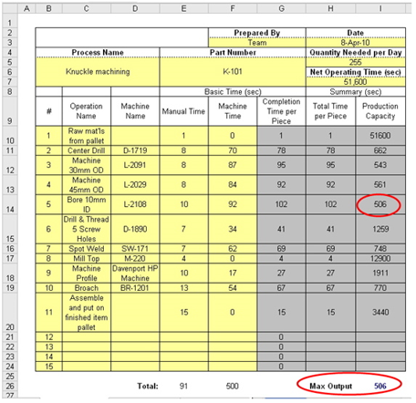

# Computer-Aided Process Planning

## Introduction to Process Planning

### Definition

- The function within a manufacturing facility that establishes which **processes** and **parameters** are to be used to convert a piece part from its **initial form** to a **final form** predetermined in an engineering drawing
- The act of preparing detailed work instructions to produce a part

- Input
  - Part design (Drawings, CAD models)
  - Raw material (bar stock, plate, casting, forging)
  - Machining environment (available m/c and tools)
- Output
  - Process plan (operation sheet, route sheet)

### Content of A Process Plan

A list of operations required, with each operation containing the following:

- Machine tool used
- Cutter used
- Machining parameters (feed, speed, cut-depth)
- Tool paths or NC codes (if CNC is used)

For several operations on the same machine, a set-up refers to the part is fixed in a specific orientation

- Fixtures for each set-up
- Additional non-machining processes

### The Function of PP in Manufacturing

- Linking Design and Manufacturing
  - Guideline for operators to follow
  - Input to production planning
    - Job starts -> Job ends
    - Delivery date
    - Material stock planning
- Design Evaluation for Concurrent Engineering
  - Manufacturability analysis
  - Cost analysis

### Knowledge for Process Planning

1. Interpretation of engineering drawings
2. Available machining processes and practice
   1. the shape and size a process can produce
   2. the dimensional and geometrical tolerance and surface finish can be obtained
   3. the material removal rate
   4. the relative cost
3. Available tooling and fixtures
4. The use of reference books
5. Computation on machining time and cost

### Process Planning Procedure

- Study the drawing to identify all manufacturing features and notes
- Determine
  - Operations to remove the delta volumes
  - The machine for each operation
  - The sequence of operations
- For each operation
  - Select fixture to form set-up plan
  - Select a cutter
  - Select cutting parameters (speed, feed-rate, and cut depth)
- Prepare the final process plan document

### Optimization in Process Planning

- Common Problem: Many feasible process plans with different cost or machining time
- Optimization objectives
  - Minimum number of machine tools changes
  - Minimum number of set-up changes
  - Minimum number of cutter changes

### Problems in Manual Process

- Time consuming to gain the knowledge and experience
  - A typical process planner is a person approximately 50 years of age
- Industry short of good process planners
- Time consuming to perform
- Inconsistent plan resulted
- Plan lack of optimisation

## CAPP

Use of computer to help the process planner, to various degrees, in decision making required in a planning process

Advantages:

- **It can reduce the skill required of a planner**
- It can reduce the process planning time
- It can reduce both **process planning** and **manufacturing cost**
- It can create more consistent plans
- **It can produce plans with better quality**
- It can increase productivity

### Early Development of CAPP

- Constructive approach
  - Computer-assisted systems for report generation, database of available machining resources and materials and storage of plans
  - A database system with a standard form editor
- Characteristics
  - When used efficiently, these systems can save up to 40% of a process planner's time
  - It helps reduce the clerical work

### Recent Development of CAPP

- Recent developments in CAPP focused on **eliminating** the process planner
- Two approaches: variant and generative
  - The variant approach uses library retrieval procedures to find standard plans for similar components
  - In a generative process planning system, process plans are generated automatically for new components without referring to existing plans

#### Variant Process Planning

A variant process planning system uses the similarity among components to retrieve existing process plans

Group Technology is the key to variant process planning

- A process plan that can be used by a family of components is called a standard plan
- A standard plan is stored in the database with a family number as its key
- There is no limitation to the detail that a standard plan can contain. However, it must contains at least a sequence of fabrication steps or operations
- When a standard plan is retrieved, a certain degree of modification is usually necessary in order to use the plan on a new component

##### Two operation stages

- Preparatory stage
  - A variant process planning system is developed

1. Existing components are coded, and later grouped into families
2. Form part families. A family matrix is then constructed for each part family
3. Prepare standard process plans for part families. A standard process plan is written in terms of OP codes and OP plans
4. Finally, standard plans are then stored in a database and indexed by family matrices

- Production stage
  - The variant process planning system is used to generate a plan for a given component

1. An incoming component is firstly coded
2. The code is then input to a part-family search routine to find the family to which the component belongs
3. The family number is then used to retrieve a standard plan
4. The process planner may modify the standard plan to satisfy the component design

##### Problems with Variant PP

- If the part spectrum is large, the number of part families can be large, but with little efficiency
- Implementation is time consuming
- The quality of process plans for new parts depends on the quality of the existing plans
- HUman planner's intervention is inevitable. Total automated process planning cannot be achieved

#### Generative Process Planning

Process plans are created from information available in a manufacturing database without human intervention

- Knowledge of manufacturing must be captured and encoded into efficient software
- By applying decision-making logic, a process planner's decision making processes can be imitated

##### Advantages over variant PP

- It can generate consistent plan rapidly
- New components can be planned as easily as existing components
- It can potentially be interfaced with an automated manufacturing facility to provide detailed and up-to-date control information

##### Basic Elements of Generative PP

A generative PP system (computer program) usually comprises of 3 necessary elements

- Part description capability
  - The part description must be in a computer readable format
  - The translation from the original design to specific input may be tedious and difficult to automate
  - Three commonly used formats:
    - Code
    - Part description language
    - Feature-based CAD model
- Manufacturing capability database
- Decision-making logic

> feature: a collection of geometric entities

##### Feature-based Models

- Using a CAD model as input eliminates the human effort of translating a design into a code or other descriptive form
- The key task is to extract the information related to the machining features and represent them in way that matching between a feature and machining process can be found easily
- Two approaches
  - Feature recognition
    - How to decompose intersected features into individual ones
    - An optimization problem
  - Design by features
    - Feature templates are built into the CAD system
    - When a new part is to be designed, the user needs to select the proper feature from the library and specify its dimension, position, and orientation
    - The information is then stored in the data file that can be used by a CAPP system directly
    - This approach has already been implemented in some commercially available CAD packages

##### Current Status

- Hard to find ideal generative PP
- The "generative process planning" is often loosely used
- Systems with some built-in decision making logic are often called generative process planning systems
