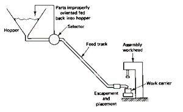

# Quantitative Analysis in Automated Assembly Machines

## Introduction

- Assembly
- Automated Assembly
- Fixed automation usually
- Where is automated assembly appropriate
  - high product demand
  - stable product design
  - the assembly consists of no more than a limited number of components
  - the product is designed for automated assembly

## Parts Delivery Devices

For any assembly machine, a means of delivering the components to the assembly workhead, parts-delivery system, is required

### Hopper

- The container into which the component type
- A separate hopper is used for each component type
- The components are usually loaded into the hopper in bulk

### Parts feeder

- A mechanism that removes the components from the hopper one at a time for delivery to the assembly workhead

> the hopper and parts feeder are often combined into one operating mechanism

### Selector and/or Orientor

- This device establishes the proper orientation of the components for the assembly workhead
- A selector acts as a filter, permitting only parts that are in the correct orientation to pass through
- An orientor allows properly oriented parts to pass but provides a re-orientation of components that are not properly oriented initially

> selector and orientor are often combined and incorporated into one hopper-feeder system

### Feed Track

To transfer the components from the hopper-feeder to the location of the assembly workhead, maintaining proper orientation of the parts during the transfer

Two general types:

- gravity type
- powered type

### Escapement and placement device

- Escapement device: To remove components from the feed track at time intervals that are consistent with the cycle time of the assembly workhead
- Placement device: to place the component in the correct location at the workstation for the assembly operation

> These two elements are sometimes combined into a single mechanism

## Quantitative Analysis

### Notations

- $f$: the remove rate of part from the hopper
- $\theta$: the proportion of components that pass through the selector
- $f\theta$: the effective rate of delivery of components
- $f(1-\theta)$: the remaining proportion is re-circulated back
- $R_c$: the cycle rate of the assembly machine
- $f\theta > R_c$ is necessary in order to prevent "stock out"

Possible problems:

1. feed track is full and jammed if there is no stopping mechanism
2. parts in the feed track will run out if there is no restarting mechanism

> Problems could be solved by two sensors

### The Functions of the Two sensors

- "High-level" Sensor
  - Near the top of the feed track to turn off the feeding mechanism when the feed track is full
  - Its location defines the active length $L_2$ of the feed track
  - If the length of component in the feed track is $L_c$, number of parts that can be held in the feed track is $n_2=L_2/L_c$
  - The value of $n_2$ is the capacity of the feed track
- "Low-level" Sensor
  - Placed along the feed track at some distance from the high-level sensor
  - Used to re-start the feeding mechanism
  - Defining the location of this sensor at length $L_1$ the number of the components in the feed track at this point is $n_1 = L_1/L_c$

### The Operating Procedures

- Starting flow rate $=f\theta-R_c$ until the queue reaches the **high-level** sensor
- The high-level sensor is activated, the flow rate (depleting parts from the track) becomes $R_c$, until the **low-level** sensor is reached
- The low-level sensor is activated, the flow rate becomes $f\theta-R_c$

### Multi-station assembly machines

#### General Description

- Several workstations using a synchronous transfer system
- Typical operation occurring at a workstation: A component is added or joined in some fashion to an existing assembly

#### Interesting Scenario

- Components may be defective
- The defective components can result in jams
- When a jam occurs, it can result in the shutdown of the entire machine until the fault is corrected

#### Analysis of the multiple

- $q$: the defective rate, the probability that the next component is defective
- $m$: the probability that defect will result in the malfunction and stoppage of the workstation
- The values of $q$ and $m$ may be different for different stations

For station $i$, when the feeder attempts to feed a component and the assembly device attempts to join it to the existing assembly, there are three possible events:

1. the component is defective and causes a station jam, with probability of $m_iq_i$
2. the component is defective but causes no jam, with probability of $(1-m_i)q_i$
3. the component is not defective, with probability of $(1-q_i)$

##### Performance Measures

**Yield**, the proportion of acceptable product. Multiplying these probabilities for all stations, we have the proportion of acceptable products coming off the line, $P_{ap}$

$$
P_{ap} = \prod_{i=1}^n{(1-q_i+m_iq_i)}
$$

The proportion of assemblies that contain at least 1 defect component

$$
P_{qp} = 1-\prod_{i=1}^n{(1-q_i+m_iq_i)}= 1-(1-q+mq)^n
$$

**Production rate**: assuming each station jam results in a machine downtime occurrence, $F$ is the frequency of downtime occurrence per cycle

$$
F = \sum_{i=1}^n{p_i} = \sum_{i=1}^n{m_iq_i}
$$

The average production time per assembly $T_p$

$$
T_p = T_c + \sum_{i=1}^n{m_iq_iT_d}
$$

- $T_c$: ideal cycle time
- $T_d$: average downtime per

The production rate

$$
R_p=\frac{1}{T_p}
$$

The production rate of acceptable assemblies $R_{ap}$ is

$$
R_{ap} = R_pP_{ap} = \frac{P_{ap}}{T_p}
$$

The line efficiency (the ratio of ideal production time to average production time) is given as

$$
E = \frac{T_c}{T_p}
$$

The **proportion of down time**

$$
D = 1-E
$$

The cost per assembly must take account of the output quality. This can be achieved by incorporating the yield of the machine:

$$
C_{pc} = \frac{C_m+C_LT_p+C_t}{P_{ap}}
$$

- $C_m$: the costs of the base part and all components added
- $C_L$: the cost per minute to operate the line
- $C_t$: the cost of any disposable tooling per assembly

> The denominator would tend to increase the cost of the assembly
> As the quality of individual components deteriorates, this results in a increased cost per assembly produced

#### Special Control Strategies

- Instantaneous Control
  - Stops the assembly machine when a defect occurs
  - $m=1$
- Memory Control
  - The assembly machine is provided with logic that identifies when a defective component is encountered
  - It does not stop the machine
  - Instead, it remembers the position of the assembly that is affected, locking it out from additional assembly operations at subsequent workstations, and rejects the assembly after the last station
  - $m=0$

### Single-station assembly machines

A single workhead, with several components feeding into the station to be assembled

n represents the number of distinct assembly elements that are performed on the machine. An element can be feeding a component or a fastening operation

Each element has an element time $T_{ei}$

Ideal cycle time $T_c$: the ideal cycle time fot the single station assembly machine

$$
T_c = T_h+\sum_{i=1}^n{T_{ei}}
$$

- $T_h$: handling time (loading and unloading

The average production time per assembly $T_p$ including downtime caused by jams

$$
T_p = T_C + \sum_{i=1}^n{m_iq_iT_d}
$$

Determination of yield for the single-station machine makes use of the same equations as for the multi-station machine

Uptime efficiency is computed as $E=\frac{T_c}{T_p}$

## Design for Automated Assembly

- Reduce the amount of assembly required
- Use of modular design
- Reduce the number of fasteners required
- Reduce the need for multiple components to be handled at once
- Maintain high quality (q) in components
- Implement hopperability
- Limit the required direction of access
